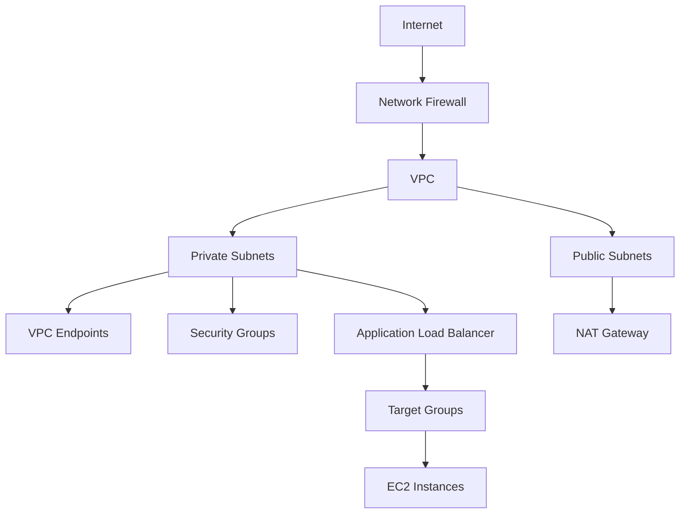

# Zero Trust Network Architecture Module

This Terraform module implements a Zero Trust Network Architecture (ZTNA) using AWS services. It provides secure network access, micro-segmentation, and continuous verification of network traffic.

## Features

- **Network Micro-segmentation**
  - VPC segmentation
  - Security group isolation
  - Network ACLs
  - Route table separation

- **Access Control**
  - IAM-based authentication
  - Security group rules
  - Network ACL rules
  - VPC endpoint policies

- **Traffic Inspection**
  - Network Firewall
  - VPC Flow Logs
  - CloudWatch monitoring
  - Security Hub integration

- **Compliance and Governance**
  - Audit logging
  - Access monitoring
  - Policy enforcement
  - Compliance reporting

## Architecture



## Usage

```hcl
module "zero_trust_network" {
  source = "./modules/zero_trust_network"

  environment = "prod"
  vpc_cidr    = "10.0.0.0/16"
  
  private_subnet_cidrs = [
    "10.0.1.0/24",
    "10.0.2.0/24",
    "10.0.3.0/24"
  ]
  
  public_subnet_cidrs = [
    "10.0.101.0/24",
    "10.0.102.0/24"
  ]

  enable_flow_logs = true
  flow_log_retention_days = 30

  tags = {
    Environment = "prod"
    Service     = "zero-trust-network"
  }
}
```

## Requirements

| Name | Version |
|------|---------|
| terraform | >= 1.0.0 |
| aws | ~> 5.0 |

## Inputs

| Name | Description | Type | Default | Required |
|------|-------------|------|---------|:--------:|
| environment | Environment name (e.g., dev, staging, prod) | `string` | n/a | yes |
| vpc_cidr | CIDR block for the VPC | `string` | n/a | yes |
| private_subnet_cidrs | List of CIDR blocks for private subnets | `list(string)` | n/a | yes |
| public_subnet_cidrs | List of CIDR blocks for public subnets | `list(string)` | n/a | yes |
| enable_flow_logs | Whether to enable VPC Flow Logs | `bool` | `true` | no |
| flow_log_retention_days | Number of days to retain flow logs | `number` | `30` | no |
| enable_network_firewall | Whether to enable Network Firewall | `bool` | `true` | no |
| firewall_policy_arn | ARN of the Network Firewall policy | `string` | `null` | no |
| tags | Additional tags to apply to all resources | `map(string)` | `{}` | no |

## Outputs

| Name | Description |
|------|-------------|
| vpc_id | The ID of the VPC |
| vpc_cidr_block | The CIDR block of the VPC |
| private_subnet_ids | List of private subnet IDs |
| public_subnet_ids | List of public subnet IDs |
| private_route_table_ids | List of private route table IDs |
| public_route_table_id | The ID of the public route table |
| nat_gateway_ids | List of NAT Gateway IDs |
| network_firewall_id | The ID of the Network Firewall |
| network_firewall_policy_arn | The ARN of the Network Firewall policy |
| vpc_endpoint_ids | Map of VPC endpoint IDs |
| security_group_ids | Map of security group IDs |
| flow_log_id | The ID of the VPC Flow Log |
| flow_log_arn | The ARN of the VPC Flow Log |
| kms_key_arn | The ARN of the KMS key used for encryption |
| kms_key_id | The ID of the KMS key used for encryption |

## Security Considerations

### Network Security
- VPC with private and public subnets
- Network ACLs for subnet-level security
- Security groups for instance-level security
- Network Firewall for traffic inspection
- VPC endpoints for private AWS service access

### Access Control
- IAM roles and policies
- Security group rules
- Network ACL rules
- VPC endpoint policies
- Route table configurations

### Monitoring and Logging
- VPC Flow Logs
- CloudWatch Logs
- Network Firewall logs
- Security Hub findings
- CloudTrail events

## Maintenance

### Regular Tasks
1. Review security group rules
2. Monitor network traffic
3. Check VPC Flow Logs
4. Update Network Firewall rules
5. Review IAM permissions

### Performance Optimization
1. Monitor network latency
2. Check NAT Gateway usage
3. Optimize security group rules
4. Review VPC endpoint configurations
5. Monitor Network Firewall performance

### Cost Optimization
1. Monitor NAT Gateway costs
2. Review VPC endpoint usage
3. Optimize Network Firewall rules
4. Check flow log storage
5. Review security group rules

## Troubleshooting

See [TROUBLESHOOTING.md](./TROUBLESHOOTING.md) for common issues and solutions.

## Contributing

1. Fork the repository
2. Create a feature branch
3. Make your changes
4. Run tests
5. Submit a pull request

## License

This module is licensed under the ISC License.

## Authors

- Your Name <your.email@example.com>

## Acknowledgments

- AWS Security Best Practices
- Zero Trust Architecture Principles
- Terraform Best Practices 